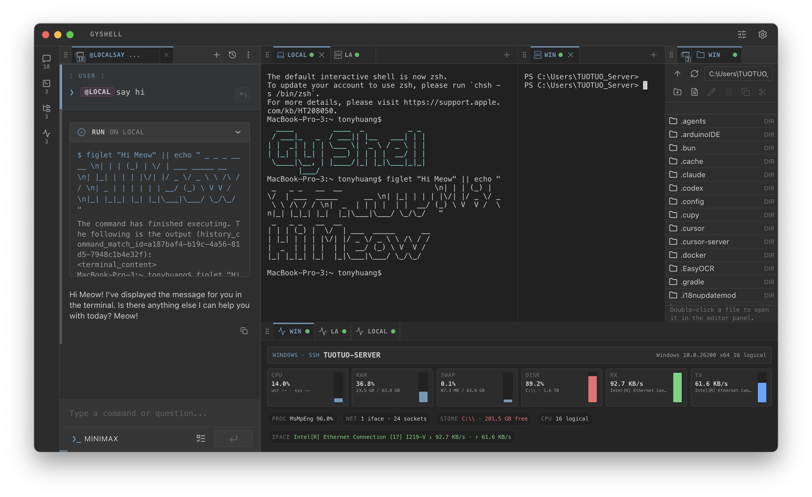

#  GyShell

> **会思考、会执行、可协作的 AI 原生终端。**

[](https://creativecommons.org/licenses/by-nc/4.0/)
[](#支持平台)
[](#核心能力)

[English README](./README.md) | 中文 README  
最新发布说明：[`changelogs/v1.2.0.md`](./changelogs/v1.2.0.md)

如果有任何建议或者问题，欢迎在 [GitHub Discussions](https://github.com/MrOrangeJJ/GyShell/discussions) 中提交。

使用教程:
[`docs/mobile-web-usage.md`](./docs/mobile-web-usage.md) ·
[`docs/tui-usage.md`](./docs/tui-usage.md) ·
[`docs/gybackend-usage.md`](./docs/gybackend-usage.md)

> [!WARNING]
> **项目处于快速迭代阶段**：如果某个版本引入了历史数据兼容性变更，会在发布说明中明确标注。

<p align="center">
  
</p>
<p align="center">
  <video controls width="100%" src="https://github.com/user-attachments/assets/f9daf884-bda0-4a58-8a6d-934db0eddeb5"></video>
</p>

---

## GyShell 的差异化价值

很多 AI 终端工具要么一次性给脚本，要么跑在与真实工作流脱节的隔离沙盒里。

GyShell 的定位是“运行在真实终端中的持续执行系统”：

- **持续执行闭环**：读取输出 -> 判断状态 -> 继续推进。
- **天然可干预**：你可以随时接管，不打断工作流。
- **多标签并行调度**：编译、看日志、修复可跨标签协同。
- **工作区可恢复**：terminal tab 与面板布局可跨重启恢复，快速续作。
- **可拆分的多窗口工作区**：面板可独立成子窗口，标签和整块面板都能跨窗口移动。
- **集成文件管理**：可视化文件浏览、编辑、跨本地/SSH 会话传输，无需离开工作区。
- **实时资源可视化**：本地与 SSH 会话都可直接查看 CPU、内存、磁盘、网络、进程、套接字、GPU 等信息。
- **OpenClawd 风格远程对话控制**：核心运行在你自己的电脑上，你可以在任何地方通过对话持续控制。
- **桌面端内置 Mobile Web 发布能力**：可直接在桌面设置中对局域网发布移动端页面并复制访问链接。
- **多端同语义**：桌面端、TUI、Mobile Web 共用统一网关模型。
- **Profile Lock 安全性**：会话繁忙期间锁定模型配置，保证行为一致。
- **长上下文质量保障**：`memory.md` + 智能压缩链路让长会话依然可控可用。
- **工具能力原生化**：Skills、MCP、内置工具是运行时一等能力。

### 一屏速览

- **面向真实交付**：不仅“给方案”，还能持续执行和纠偏。
- **面向长流程任务**：会话状态连续，不是一次性问答。
- **面向真实基础设施**：Shell、SSH、端口转发、文件管理、多标签交互式终端控制。
- **面向多设备协作**：桌面端 + TUI + Mobile Web 共用网关语义。
- **面向多模态执行**：单轮里可组合文字与图片输入，直接推进真实任务。

## v1.2.0 关键亮点

- **可拆分的多窗口工作区**
  - 聊天、终端、文件、编辑器、监控面板都可独立到子窗口
  - 支持标签和整块面板跨窗口拖拽移动
  - 独立窗口的状态交接更稳，不容易丢失聊天或编辑器上下文
- **桌面端内置 Mobile Web 服务**
  - 直接在设置里启动移动端页面服务
  - 可复制已带网关地址的访问链接，手机打开更直接
  - 网关新增 `仅局域网` 与 `自定义 IP 范围` 模式
- **资源监控面板**
  - 作为一等面板查看 CPU、内存、磁盘、网络、进程、套接字、GPU 信息
  - 本地终端和 SSH 终端都支持
- **Linux 桌面版支持**
  - 正式提供 `x64` 与 `arm64` 桌面构建
  - 支持 AppImage、deb、pacman、rpm 产物
  - Linux 标题栏、窗口控制和内置 CLI 运行时细节补齐

---

## 核心能力

### AI 原生运行时

- 面向复杂任务的思考式执行流程。
- 基于终端上下文和选中资源的上下文感知。
- 长会话智能压缩与上下文保真。
- 支持通过 `memory.md` 注入全局持久记忆。
- 支持多模态输入链路（文字 + 图片）。
- 支持 OpenAI 兼容接口模型。

### 终端、SSH 与文件管理

- 原生支持 Zsh、Bash、PowerShell。
- SSH 支持密码/密钥认证、代理链路、堡垒机场景。
- 端口转发支持 Local / Remote / Dynamic SOCKS。
- Agent 可在单个任务中同时协调**多个 SSH/本地 terminal tab**。
- 支持控制字符，便于操控交互式终端程序。
- 支持 terminal tab 跨后端重启恢复，并在同一后端运行期内为终端视图重挂载/重连提供输出无损补齐。
- **集成文件浏览面板**：可在本地与 SSH 会话中浏览、创建、重命名、删除和预览文件。
- **跨会话文件传输**（复制/移动），实时进度展示、单任务取消、自适应 SFTP 传输调优。
- **内置文本编辑器面板**：直接在工作区内编辑文件，无需切换工具。

### 工作区与监控

- 面板可拆到独立子窗口，标签和整块面板都能跨窗口移动。
- 可从工作区 Rail 直接打开资源监控面板，覆盖本地与 SSH 终端。
- 监控面板可展示 CPU、内存、磁盘、网络、进程、套接字，以及可用时的 GPU 信息。

### Skills + MCP + Tools

- 支持文件夹式 Skills 组织与复用。
- MCP 服务器可动态接入与管理。
- 提供精细化文件编辑能力，减少粗暴覆盖。
- 工具启用状态可被各客户端实时读取与控制。

### Mobile Web 伴随端

- 面向手机浏览器的远程会话伴随与控制体验。
- 桌面端可直接托管 Mobile Web，并在设置中复制访问链接。
- 支持 OpenClawd 风格的对话式远程操控（核心运行在你的电脑上）。
- 会话列表支持搜索和运行状态提示。
- 会话列表支持左滑删除，移动端清理更高效。
- 可在移动端查看单轮详细事件链路。
- 通过网关 RPC 统一访问工具、技能、终端、设置能力。
- 网关暴露范围支持仅本机、仅局域网、自定义 CIDR 范围和全部网卡。

---

## 支持平台

1. **Electron 桌面端**（`apps/electron`）
2. **独立后端运行时**（`apps/gybackend`）
3. **TUI 运行时**（`apps/tui` + `packages/tui`）
4. **Mobile Web 运行时**（`apps/mobile-web` + `packages/mobile-web`）

### 怎么选入口？

- **桌面端**：主力全功能体验，适合日常开发。
- **TUI（`gyll`）**：键盘优先、终端原生、自动化友好，并可做多标签并行调度。
- **Mobile Web**：OpenClawd 风格远程对话控制，适合随时随地接管活跃会话。

---

## 快速开始

### 前置要求

- Node.js 18+
- npm

### 本地开发

```bash
git clone https://github.com/MrOrangeJJ/GyShell.git
cd GyShell
npm install
npm run dev
```

### 首次 CLI 体验

安装并启动一次桌面版后，可直接体验：

```bash
gyll --help
gyll "规划并执行：运行测试、修复失败并总结改动"
```

### 一句话理解 GyShell

`GyShell = 持续 AI 运行时 + 真实终端控制 + 随时人工接管。`

### Mobile Web 开发

```bash
npm run dev:mobile-web
```

### TUI 开发

```bash
npm run dev:tui
```

---

## 桌面版内置 CLI（`gyll`）

安装并启动一次 GyShell 桌面版后，可使用 `gyll`。

不传 `--url` 时，CLI 会尝试连接本机桌面后端（默认 `127.0.0.1:17888`）。

```bash
gyll --help
gyll --url ip:port
gyll --url ip:port --token <access_token>
gyll --url ip:port "你好"
gyll --url ip:port --token <access_token> "你好"
gyll run --url ip:port "执行任务"
gyll hook --url ip:port "发送后退出"
```

本机快速模式：

```bash
gyll
gyll "你好"
gyll run "执行任务"
gyll hook "发送后退出"
```

模式区别：

- `gyll`：进入交互式 TUI。
- `gyll "消息"`：新建会话并发送首条消息，然后进入 TUI。
- `gyll run "消息"`：新建会话并在终端流式输出，不进入 TUI。
- `gyll hook "消息"`：新建会话，发送一次后立即退出。

连接到非本机 websocket 网关时，请附带 `--token <access_token>`。

恢复指定会话：

```bash
gyll --sessionid "your-session-id"
```

`hook` 模式适合长流程任务中的回调唤醒场景。

### `gyll` 常见使用模式

- **交互协作**：`gyll`
- **先发一条再进入 TUI**：`gyll "消息"`
- **偏自动化流式输出**：`gyll run "消息"`
- **回调信号 / 自唤醒**：`gyll hook "消息"`

---

## 架构说明（简版）

GyShell 采用严格分层：

- `packages/*`：承载实现逻辑。
- `apps/*`：仅承载组合、启动、构建壳层。
- 前端实现代码不放入 `packages/backend`。

核心运行链路（简化）：

1. `startElectronMain`（桌面组合入口）
2. `GatewayService`（会话运行时与跨传输编排）
3. `WebSocketGatewayControlService`（访问策略控制）
4. `WebSocketGatewayAdapter` / `ElectronWindowTransport`（传输层实现）
5. TUI 与 Mobile Web 客户端控制器

详见：

- `docs/monorepo-architecture.md`
- `docs/build-commands.md`

## 隐私与更新策略

- 版本检查只请求本项目 GitHub 仓库中的 `version.json`。
- 不使用第三方自动更新接口。
- 版本检查是应用自动后台网络请求中的唯一来源。

## 延伸阅读

- 发布说明：`changelogs/v1.2.0.md`
- 构建与打包命令矩阵：`docs/build-commands.md`
- Monorepo 边界与运行链路：`docs/monorepo-architecture.md`

---

## 构建与打包

- `npm run build`
- `npm run build:backend`
- `npm run build:tui`
- `npm run build:mobile-web`
- `npm run dist`
- `npm run dist:mac`
- `npm run dist:win`
- `npm run dist:linux`
- `npm run dist:linux-arm64`
- `./build.sh --help`

完整命令矩阵与打包约束见 `docs/build-commands.md`。

---

## 许可证

项目使用 **CC BY-NC 4.0** 许可证。

特别鸣谢：参考与启发来源于 [Tabby](https://github.com/Eugeny/tabby)（MIT）。

---

**GyShell** - _会和你一起思考并执行的终端。_
